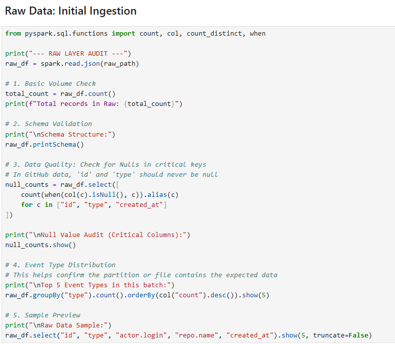
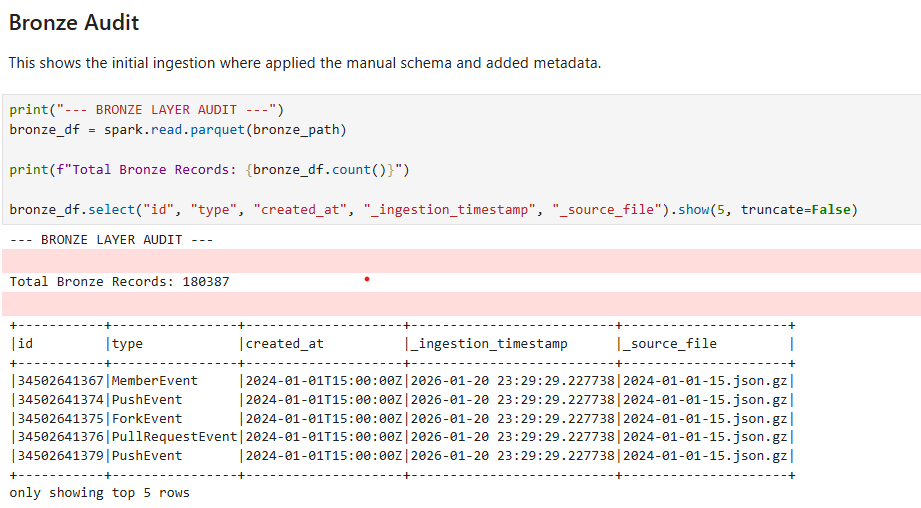
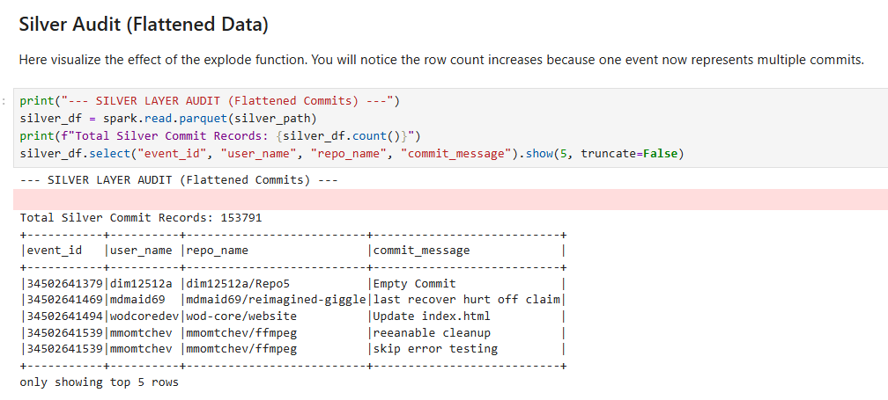
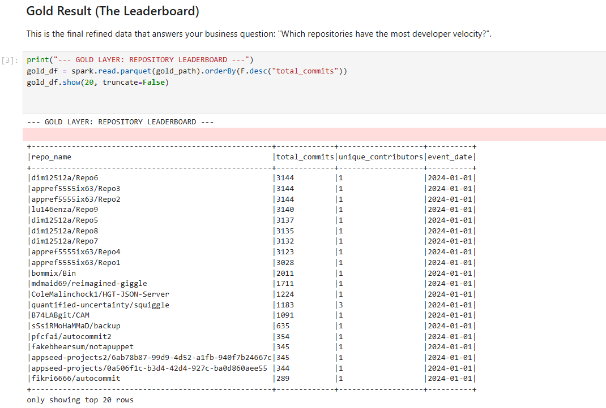

# GitHub Event Lakehouse: Developer Velocity Analytics 🚀
## 📌 Project Mission
The goal of this project is to build a scalable Medallion Architecture that processes high-volume event data from the GitHub Archive. This implementation serves as a functional Proof of Concept (PoC), successfully ingesting and transforming data for a targeted window (January 1, 2024, at 15:00 UTC) to validate end-to-end Spark transformation logic.

## Business Objective: To identify Developer Velocity—measuring which open-source repositories are receiving the highest density of active code contributions (commits) to signal trending technologies and project health.

## 🛠 Technical Implementation
1. 🥉 Bronze Layer: Robust Ingestion
Schema-on-Read Safeguards: Implemented manual StructType schema definition to prevent pipeline failures caused by unexpected GitHub API drift.
Auditability: Enriched raw JSON with _ingestion_timestamp and _source_file metadata to ensure 100% data lineage.
Storage Optimization: Converted raw .json.gz to Parquet format, leveraging columnar storage for significant compression and optimized read performance.

2. 🥈 Silver Layer: Advanced Transformation
Complex Data Flattening: Leveraged Spark's explode function to de-normalize nested commit arrays into atomic rows, enabling granular analysis of individual contributions.
Quality Filtering: Isolated PushEvent types and performed rigorous data cleaning, including null handling and type casting.
Idempotent Pipelines: Implemented Dynamic Partition Overwrite by event_date, ensuring that re-processing a specific hour's data does not corrupt or duplicate existing records.

3. 🥇 Gold Layer: Analytics & Consumption
Business Logic: Developed aggregation logic to calculate Developer Velocity—measuring Total Commits vs. Unique Contributors per repository.
Performance Tuning: Optimized final tables for downstream consumption, ensuring sub-second query responses for dashboarding and visualization.

## 🛡️ Handling Data Quality & Edge Cases
To ensure production-grade reliability, the pipeline includes:

Corrupt Record Handling: Configured Spark to handle malformed JSON records gracefully without crashing the job.
Schema Evolution: Used explicit schema definitions to maintain stability despite upstream API changes.
Late-Arriving Data: The partitioning strategy allows for seamless integration of late-arriving event files.

## 💻 Tech Stack
Language: Python (PySpark)
Engine: Apache Spark 3.x
Storage: Parquet / Delta Lake
Architecture: Medallion (Bronze, Silver and Gold Layers)
Data Source: GitHub Archive (JSON.GZ) 
